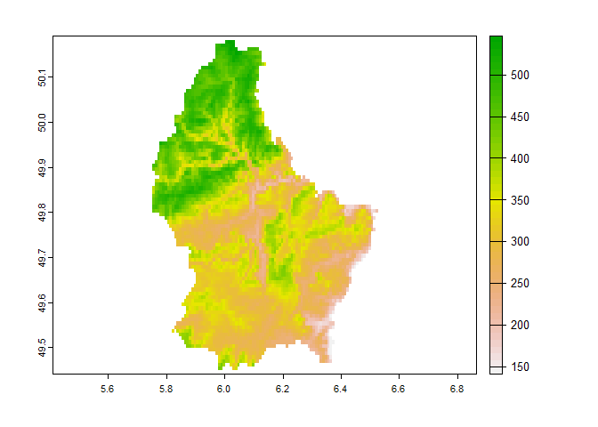
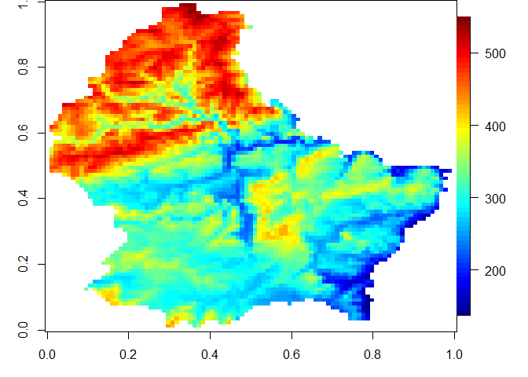
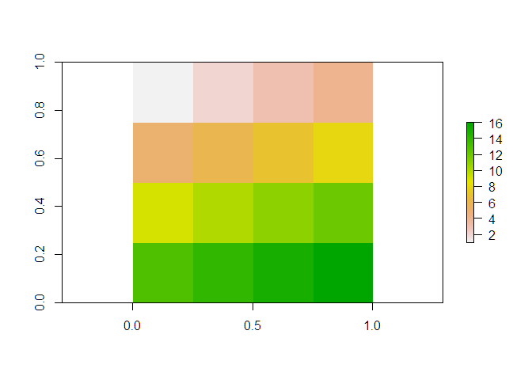
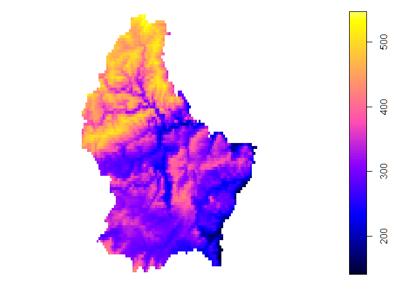

rast array
================

# 1 `rast` array

``` r
library(sf2)
library(terra)
library(fields)
library(magrittr)

ext2bbox <- function(x, ...) as.vector(ext(x, ...))
```

> 为了更好的理解R语言中空间数据的排列顺序。

为了便于记忆，无论是`SpatialGridDataFrame`、`SpatialPixelsDataframe`，
arr是image.plot中绘图看起来正确的matrix或者3d array。

``` r
# Create a SpatRaster from a file
f <- system.file("ex/elev.tif", package="terra")
r <- rast(f)
plot(r)
```

<!-- -->

``` r
## 1. arr
par(mar = c(3, 3, 0, 0))
arr = rast_array(r)
arr %>% image.plot()
```

<!-- -->

``` r
image(arr)
```

<!-- -->

## 1.1 `rast` array

arr中的数据，绘图展示的顺序与print中展示的顺序完全一致。

``` r
mat = matrix(1:16, nrow = 4, byrow = TRUE)
print(mat)
```

    #      [,1] [,2] [,3] [,4]
    # [1,]    1    2    3    4
    # [2,]    5    6    7    8
    # [3,]    9   10   11   12
    # [4,]   13   14   15   16

``` r
r = raster::raster(mat)
plot(r)
```

<!-- -->

``` r
g = as_SpatialGridDataFrame(r)
all.equal(as.data.frame(r), g@data)
```

    # [1] TRUE

``` r
all.equal(values(r), as.numeric(mat %>% t()))
```

    # [1] TRUE

## 1.2 `sp` numeric order

``` r
g = rgdal::readGDAL(f) # wierd order
```

    # D:/Documents/R/win-library/4.1/terra/ex/elev.tif has GDAL driver GTiff 
    # and has 90 rows and 95 columns

``` r
plot(g)
```

<!-- -->

``` r
all.equal(g$band1, as.numeric(Ipaper::flipud(arr)))
```

    # [1] TRUE

``` r
summary(g$band1 - as.numeric(Ipaper::flipud(arr)))
```

    #    Min. 1st Qu.  Median    Mean 3rd Qu.    Max.    NA's 
    #       0       0       0       0       0       0    3942

## 1.3 `sf2` make_grid

``` r
cellsize = g@grid@cellsize

g2 = make_grid(ext2bbox(g), cellsize)
g2@data = data.frame(x = as.numeric(arr))
plot(g2)
```

<!-- -->

``` r
g_vec = make_grid(ext2bbox(g), cellsize, type = "vec")
g_vec@data = data.frame(x = as.numeric(arr %>% Ipaper::flipud()))
plot(g_vec)
```

<!-- -->
