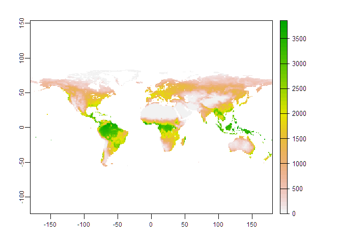
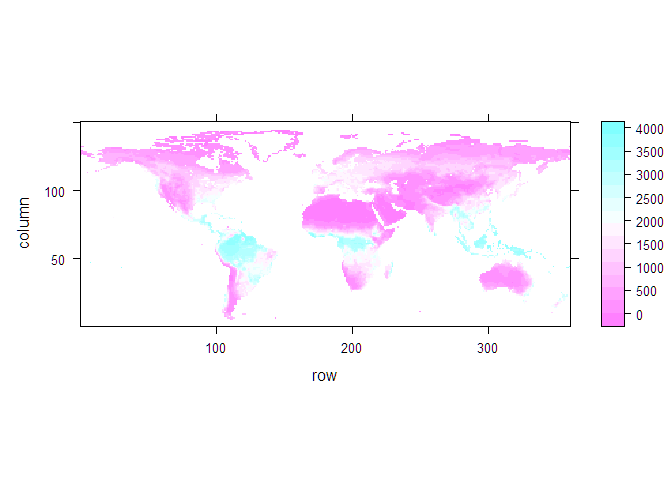
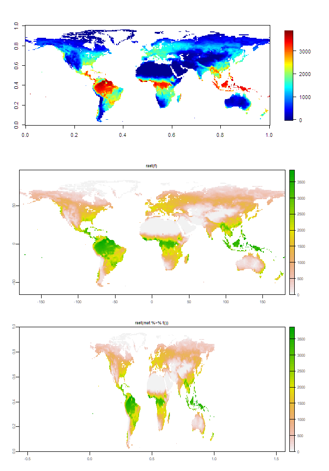
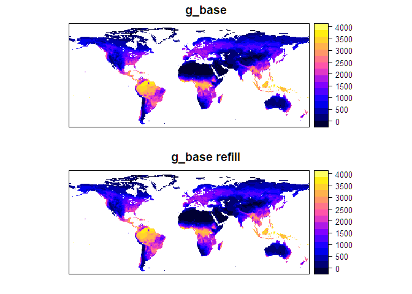
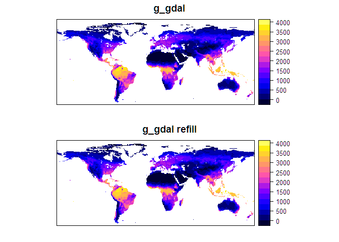
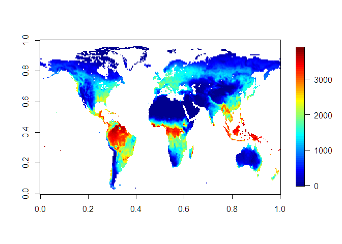

R语言栅格数据–数据排序
================

**R语言中，若想制作出地理位置正确的空间图，数据排序需要满足如下要求：**

<u>**Table1.** 空间数据中数据排序要求。</u>

| 函数                                                                                                                                                                                                                                                                                                                             | 数据名称 | 数据格式          | 其他说明                                                                                                                                                           |
|----------------------------------------------------------------------------------------------------------------------------------------------------------------------------------------------------------------------------------------------------------------------------------------------------------------------------------|----------|-------------------|--------------------------------------------------------------------------------------------------------------------------------------------------------------------|
| image, fileds::image.plot, lattice::levelplot                                                                                                                                                                                                                                                                                    | mat_base | `[lon, lat]`      | `mat_base` to `mat_rast`:<br />`t() %>% fliplr()`, `flipud() %>% t()`                                                                                              |
| raster::raster, terra::rast<br />raster::as.array                                                                                                                                                                                                                                                                                | mat_rast | `[rev(lat), lon]` | `mat_rast` to `mat_gdal`:<br />`t() %>% flipud()`, `fliplr() %>% t()`                                                                                              |
| g_base = sf2::make_grid(type = “base”)                                                                                                                                                                                                                                                                                           | mat_base | `[lon, lat]`      | **优势：**<br/>(1) lon、lat都是按照从小到大进行排列，符合常规习惯；<br/> (2) 此种格式，R语言基础绘图可以正常出图<br /><br />**劣势：**<br/>与所有空间数据R包相悖。 |
| \(a\) g_gdal = sf2::make_grid(type = “gdal”), <br/>(b) rgdal、sp、terra、raster的计算函数返回的均是这种数据排列格式，<br />如：raster::values, raster::area, terra::values, terra::as.data.frame，他们是按照g_gdal排序格式，与其构造函数中数据排序无关。<br />(c) **terra::writeCDF保存的nc文件**, ncdf4::ncvar_get获取的array。 | mat_gdal | `[lon, rev(lat)]` | `mat_base` to `mat_gdal`:<br />flipud()<br /><br />`mat_rast` to `mat_gdal`:<br />`t()`                                                                            |

> 其中， `rev(lat)`代表倒序的lat。
>
> 注意：`g_mat`转化为raster::raster或terra::rast之后，则按照新的数据格式排列数据。

涉及的R包：

``` r
library(raster)
library(terra)
library(rgdal)

library(magrittr)
library(fields) # image.plot
library(Ipaper) # flipud, fliplr; install_github("rpkgs/Ipaper")
library(sf2)    # make_grid; install_github("rpkgs/sf2")
```

# 1 实战训练

采用PML-V2模拟的GPP 2014年、1°的栅格数据为输入。

``` r
f = "data/PMLV2_veg-dynamic_GPP_2014.tif"
r = rast(f)
plot(r)
```

<!-- -->

``` r
# tif数据转化为nc
f_nc = "data/PMLV2_veg-dynamic_GPP_2014.nc"
if (!file.exists(f_nc)) writeCDF(r, f_nc, "GPP", "gC m-2 y-1")
```

``` r
library(lattice)
# 获取array并进行绘图
arr = rast_array(r)[,,1] # t() %>% flipud()
levelplot(arr)
```

<!-- -->

``` r
par.old = par()
# image.plot(arr)
# image(arr)
# par(par.old)
```

``` r
library(ncdf4)
library(nctools)
```

    # 
    # 载入程辑包：'nctools'

    # The following objects are masked from 'package:Ipaper':
    # 
    #     ok, warn

``` r
f = "data/PMLV2_veg-dynamic_GPP_2014.nc"
fid = nc_open(f)
fid
```

    # File data/PMLV2_veg-dynamic_GPP_2014.nc (NC_FORMAT_CLASSIC):
    # 
    #      2 variables (excluding dimension variables):
    #         float GPP[longitude,latitude]   
    #             _FillValue: -1.17549402418441e+38
    #             long_name: gC m-2 y-1
    #             grid_mapping: crs
    #         int crs[]   
    #             crs_wkt: GEOGCRS["WGS 84",    DATUM["World Geodetic System 1984",        ELLIPSOID["WGS 84",6378137,298.257223563,            LENGTHUNIT["metre",1]]],    PRIMEM["Greenwich",0,        ANGLEUNIT["degree",0.0174532925199433]],    CS[ellipsoidal,2],        AXIS["geodetic latitude (Lat)",north,            ORDER[1],            ANGLEUNIT["degree",0.0174532925199433]],        AXIS["geodetic longitude (Lon)",east,            ORDER[2],            ANGLEUNIT["degree",0.0174532925199433]],    ID["EPSG",4326]]
    #             spatial_ref: GEOGCRS["WGS 84",    DATUM["World Geodetic System 1984",        ELLIPSOID["WGS 84",6378137,298.257223563,            LENGTHUNIT["metre",1]]],    PRIMEM["Greenwich",0,        ANGLEUNIT["degree",0.0174532925199433]],    CS[ellipsoidal,2],        AXIS["geodetic latitude (Lat)",north,            ORDER[1],            ANGLEUNIT["degree",0.0174532925199433]],        AXIS["geodetic longitude (Lon)",east,            ORDER[2],            ANGLEUNIT["degree",0.0174532925199433]],    ID["EPSG",4326]]
    #             proj4: +proj=longlat +datum=WGS84 +no_defs
    #             GeoTransform: -180 1 0 90 0 -1
    # 
    #      2 dimensions:
    #         longitude  Size:360 
    #             units: degrees_east
    #             long_name: longitude
    #         latitude  Size:150 
    #             units: degrees_north
    #             long_name: latitude
    # 
    #     3 global attributes:
    #         Conventions: CF-1.4
    #         created_by: R, packages ncdf4 and terra (version 1.4-22)
    #         date: 2022-02-08 16:57:31

``` r
lat <- ncvar_get(fid, "latitude")
lon <- ncvar_get(fid, "longitude")
mat = ncvar_get(fid, "GPP") # [lon, lat], lat为倒序

dim(mat)
```

    # [1] 360 150

``` r
old.par = par(mfrow = c(3, 1))
image.plot(mat %>% flipud())
plot(rast(f), main = "rast(f)")
plot(rast(mat %>% t()), main = "rast(mat %>% t())")
```



``` r
par(old.par)
```

## 1.1 `SpatialPixelsDataFrame` in `mat` style

``` r
# `mat2vec`和`vec2mat`共用相同的转换下标, 可以逆向转化。
index_mat2vec <- function(dim) {
  ind = array(1:prod(dim), dim = dim)
  flipud(ind) %>% as.numeric()  
}
```

``` r
ext = c(-180, 180, -60, 90)
cellsize = 1
# cellsize = g@grid@cellsize

g_base = make_grid(ext, cellsize)
# mat_base: [lon, lat], lat为正序
g_base@data = data.frame(x = as.numeric(mat %>% flipud()))

# par(mfrow = c(2, 1))
p1 = sp::spplot(g_base, main = "g_base")

# SpatialPixelsDataFrame 转化为raster之后，排序则按照raster的格式进行排序，无论mat或vec格式。
val = raster(g_base) %>% values()
dim <- g_base@grid@cells.dim
ind <- index_mat2vec(dim)

g_base$x = val[ind]
p2 = sp::spplot(g_base, main = "g_base refill") # passed test
cowplot::plot_grid(p1, p2, nrow = 2)
```

<!-- -->

``` r
all.equal(val[ind][ind], val)
```

    # [1] TRUE

## 1.2 SpatialGrid in `vec` style

``` r
g_gdal = make_grid(ext, cellsize, type = "gdal")

g_gdal@data = data.frame(x = as.numeric(arr %>% Ipaper::flipud()))
p1 = sp::spplot(g_gdal, main = "g_gdal")

val <- raster(g_base) %>% values()
g_gdal$x <- val # [ind]  # `raster` to `g_gdal`
g_gdal$x <- g_base$x[ind] # `g_base` to `g_gdal`
p2 = sp::spplot(g_gdal, main = "g_gdal refill") # passed test
cowplot::plot_grid(p1, p2, nrow = 2)
```

<!-- -->

``` r
par(old.par)
# `mat_rast`转为`mat`，solution1
mat2 = raster(g_base) %>% as.matrix() %>% t() %>% flipud()
# `mat_rast`转为`mat`，solution2
mat3 = raster(g_base) %>% as.matrix() %>% fliplr() %>% t()

print(all.equal(mat2, mat3)) # true
```

    # [1] TRUE

``` r
image.plot(mat3)
```

<!-- -->
